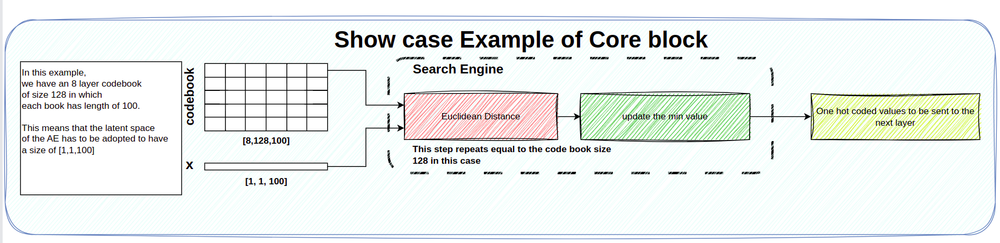

# embedded-rvq
This repository is to analyze different strategies to implement Residual Vector Quantization for the resource-constrained devices with small memory and computational power. 


## Requirements

No specific requirement. This example should run without issue on all chips/boards/OSes.

## How to Run 

First, you should configure gap9_sdk. This is a private repository and to access it, you should ask GreenWaves Technology for the permission.

Then, navigate to directory where CMakeLists.txt is and run the following commands.

``` bash
cmake -B build 
cmake --build build --target menuconfig 
cmake --build build --target run >log.txt
```

At the second command, you can chose your target [board or GVSOC]. 

## Implemented Version of Vector Quantization Core block 

In the inference mode of the VQ, a given input vector should have a size of [b, n, d], where b (batch) = 1, n (codebook size) = 1, and d = sequence_length of the input vector. The "d" size must match the dimension of the codebook; otherwise, a projection step is required before entering the VQ block. 
</br>
For instance, in the example shown in Fig. 1, each layer of the codebook has a shape of [128, 100]. It applies that the codebook has 128 codewords, each of which has a length of 100 samples. 



The critical point of the former analysis is the search engine section, which has a demanding execution time. 

**TODO:** Add implementation for parallel execution of the search engine section.

## Current Versions: 

We implement several versions of this search engine to find the most accurate and reliable low-latency case. 

### Python: 

In the ``` python ``` folder, you can find each portion of the code at a high level using libraries such as ``` einops ``` and low-level ones close to the embedded versions by deploying the low-level functions of ``` PyTorch ```. 

### Vanilla Version: 

This is the one-core simple implementation of the search engine. You can follow the ``` How to Run ``` Section to run it. The ``` vanilla ``` folder is dedicated to the developments of this version.  

**Current Status:** The VQ module is Finalized. The outcome of this version is the number of the codeword to be considered as the quantized version of the latent space.   
</br>

#### Profiling on GAP9  
In this section, we provide profiling different sections of the search engine with GAP9 and STM32 devices.

The result of profiling on GAP9 yields that each run of the ```cdist``` function for an unseen input array and a codeword is **5201** cycles for a codeword with **100** seq_len. However, a massive portion of this is due to read each codeword from FLASH of while MatMul is still the most time consuming task for the ```cdist``` function.
    
    
**TODO**: Add numbers to the above sentence and play a bit with the codebook:      
Increase the codebook size while keeping seq lenght or increase seq_len while keeping the codebooksize. 
For accuracy, is it better to have a small rather long rvq, increase layers while keep codeword size small


### Optimized Version: 

1. Apply some sort of rule on the codebook to have some in-sight on it. 
2. Use it before parallelization.

**TODO:** Read Papers on how to mathematically improve search engine.     

### Parallel Version: 

This is the multi-core implementation of the same search engine. Given the limitations of our target device, i.e., GAP9, we can follow two different parallelization scenarios: 

1. Parallelize different sections of search engines such as MatMul, MatTranspose, and MatVector / VectorMat Additions. 
2. Parallelize the execution of each distance. In this scenario, we assign each core to compute N distances (N is a dividable number by codebook size) and then report the index of the one with the least distance to the given input. 


The ``` parallel ``` folder is dedicated to the developments of this version. 

**Current Status:** TBD soon with @tommasopolonelli


## Authors: 

Amirhossein Moallemi - @MiirHo3eIN

Tommaso Polonelli - @tommasopolonelli

You can contact us via mail at [amirhmoallemi@gmail.com](mailto:amirhmoallemi@gmail.com)
